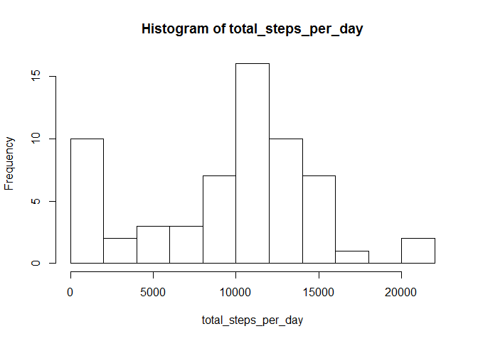
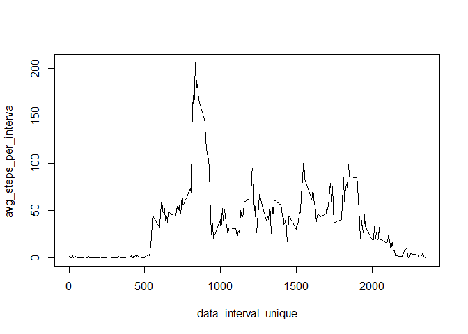
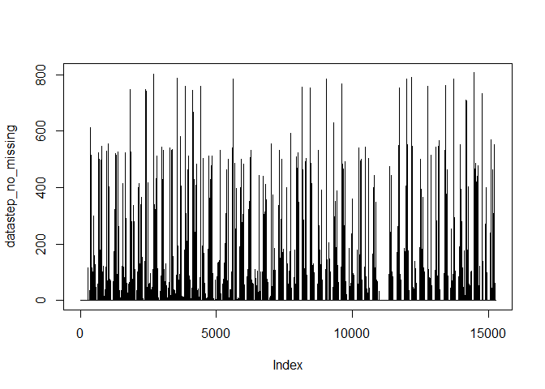

# Reproducible Research: Peer Assessment 1
Mithun IM  

## Loading and preprocessing the data


```r
data <- read.csv('activity.csv')
data1 <- data 
data_step <- data[,1]
data_interval <- data[,3]
datastep_no_missing <- data_step[!is.na(data_step)==TRUE]
datainterval_no_missing <- data_interval[!is.na(data_step)==TRUE]
```

## What is mean total number of steps taken per day?


```r
total_steps_per_day <- tapply(data$steps, data$date, sum, na.rm=TRUE)
total_steps_per_day
```

```
## 2012-10-01 2012-10-02 2012-10-03 2012-10-04 2012-10-05 2012-10-06 
##          0        126      11352      12116      13294      15420 
## 2012-10-07 2012-10-08 2012-10-09 2012-10-10 2012-10-11 2012-10-12 
##      11015          0      12811       9900      10304      17382 
## 2012-10-13 2012-10-14 2012-10-15 2012-10-16 2012-10-17 2012-10-18 
##      12426      15098      10139      15084      13452      10056 
## 2012-10-19 2012-10-20 2012-10-21 2012-10-22 2012-10-23 2012-10-24 
##      11829      10395       8821      13460       8918       8355 
## 2012-10-25 2012-10-26 2012-10-27 2012-10-28 2012-10-29 2012-10-30 
##       2492       6778      10119      11458       5018       9819 
## 2012-10-31 2012-11-01 2012-11-02 2012-11-03 2012-11-04 2012-11-05 
##      15414          0      10600      10571          0      10439 
## 2012-11-06 2012-11-07 2012-11-08 2012-11-09 2012-11-10 2012-11-11 
##       8334      12883       3219          0          0      12608 
## 2012-11-12 2012-11-13 2012-11-14 2012-11-15 2012-11-16 2012-11-17 
##      10765       7336          0         41       5441      14339 
## 2012-11-18 2012-11-19 2012-11-20 2012-11-21 2012-11-22 2012-11-23 
##      15110       8841       4472      12787      20427      21194 
## 2012-11-24 2012-11-25 2012-11-26 2012-11-27 2012-11-28 2012-11-29 
##      14478      11834      11162      13646      10183       7047 
## 2012-11-30 
##          0
```

```r
mean(total_steps_per_day)
```

```
## [1] 9354.23
```

```r
median(total_steps_per_day)
```

```
## [1] 10395
```

```r
hist(total_steps_per_day,breaks = 15) 
```

 

## What is the average daily activity pattern?


```r
avg_steps_per_day <- tapply(data$steps, data$interval, mean, na.rm=TRUE) # avg_steps_per_interval
data_interval_unique <- unique(data$interval)
plot(data_interval_unique,avg_steps_per_day,type = "l")
```

 


```r
max_avg <- avg_steps_per_day[avg_steps_per_day==max(avg_steps_per_day)]
max_interval <- which(avg_steps_per_day==max(avg_steps_per_day))
plot(datastep_no_missing,type = "l")
```

 

The maximum number of steps taken on a day was 206.1698113 on 104th 5 minute interval.

## Imputing missing values


```r
a <- sum(is.na(data[,1])) # Total number of missing days
a
```

```
## [1] 2304
```

```r
mean_steps_per_day <- tapply(data$steps, data$date, mean, na.rm=TRUE)
```

## Are there differences in activity patterns between weekdays and weekends?


```r
data1_week <- weekdays((as.POSIXct(data1[,2])))
weekend_weekday <- factor(data1_week %in% c("Saturday","Sunday"), 
               labels=c("weekday","weekend"))
week_total_steps <- tapply(data1$steps,weekend_weekday, sum, na.rm=TRUE)
weekday_avg <- week_total_steps[1]/5
weekday_avg
```

```
## weekday 
## 79383.2
```

```r
weekend_avg <- week_total_steps[2]/2
weekend_avg
```

```
## weekend 
##   86846
```

Number of steps taken during weekends are more compared to weekdays.
